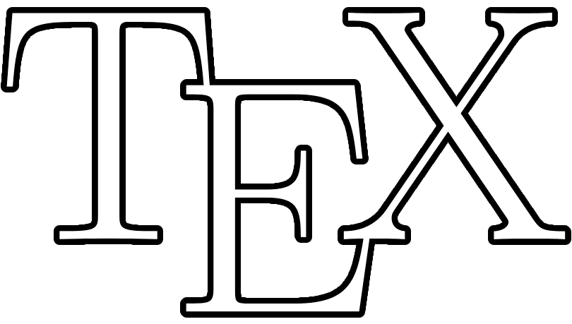

<p align="center">
    
    <span>&nbsp;&nbsp;&nbsp;</span>
    
    <span>&nbsp;&nbsp;&nbsp;</span>
    
</p>

# Concordia Tex Templates
A collection of unofficial TeX and LaTeX templates for Concordia University academic documents.

## Overview

This repository contains various templates designed for Concordia University students and faculty for creating:
- Conference/journal papers
- Academic posters
- Presentations
- Theses
- Other academic documents

## Usage

Each template is organized in its own directory with examples and instructions. Choose the appropriate template for your needs and follow the included documentation.

### VSCode Extension: LaTeX Workshop

If you plan to use these templates in VSCode, we recommend installing the [LaTeX Workshop](https://github.com/James-Yu/LaTeX-Workshop) extension. To ensure proper compilation, add LaTeX Workshop flags at the top of your .tex file to specify the correct compilation recipe.

Example:
```
%!LW recipe=latexmk (lualatex)
``` 

## Contributing

Contributions are welcome! If you have created or modified a template that might be useful for others, please consider submitting a pull request.

## License

This collection is provided for the Concordia University community. See individual template directories for specific licensing information.

## Disclaimer

These are unofficial templates and not formally endorsed by Concordia University.
